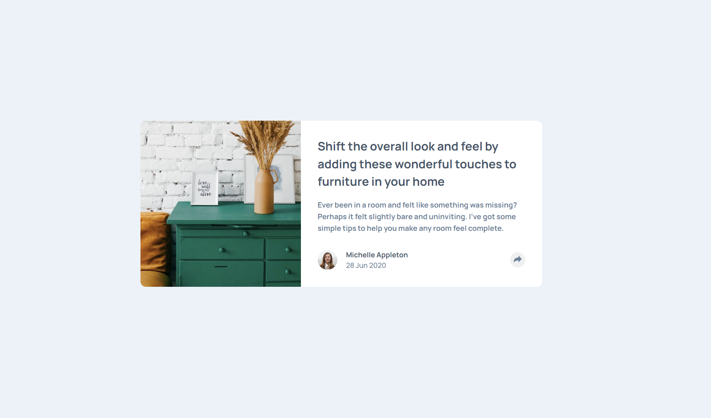

# Frontend Mentor - Article preview component solution
## Overview
### The challenge

Users should be able to:

- View the optimal layout for the component depending on their device's screen size
- See the social media share links when they click the share icon

### Screenshot

()

### Links

- Live Site URL: https://rui-martins23.github.io/article-preview-component/

## My process
### Built with

- Semantic HTML5 markup
- CSS custom properties
- Flexbox
- CSS Grid
- Mobile-first workflow

### What I learned

Definitely learned how to better use CSS position relative and position absolute, as for this challenge was a key aspect.
Need to practice this more, as this tool shown to be crucial for features like the social-icon box, needed in this challenge.

### Useful resources

- MDN Developer Docs for getting a refresh and a better understanding of CSS Position concepts

## Author

- [@Rui-Martins23] https://www.frontendmentor.io/profile/Rui-Martins23
